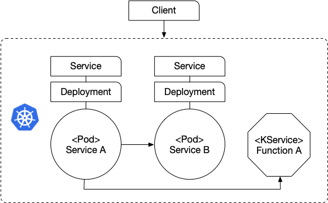
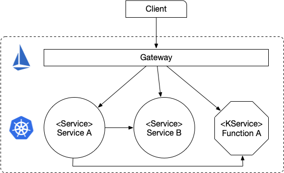
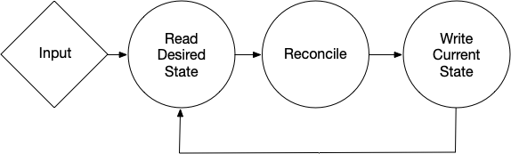
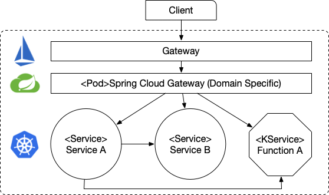
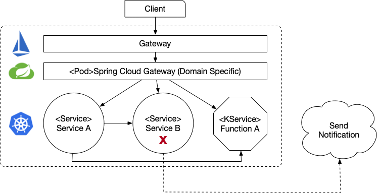
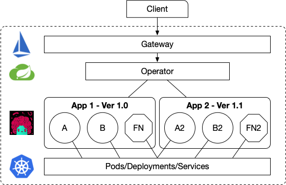
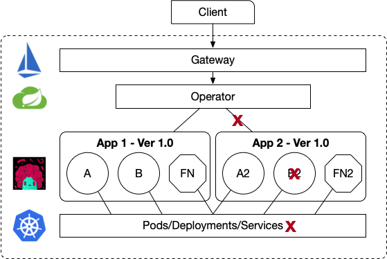

# Extending Kubernetes with Spring Cloud
This repository serves as an index for a workshop like set of excersices about creating our custom resource definitions for Kubernetes using Spring Cloud components. 

During these exercises, you will learn about how to create your custom extensions, deploy them and use them as part of a Kubernetes Operator that will understand the domain specific restrictions that needs to be applied to the infrastructure.
At the end you can find also some useful links to other related projects. 


## Repositories
We will use the following repositories to build our services and our Kubernetes Operator:
- [K8s Operator](https://github.com/salaboy/k8s-operator)
- [Example Service A](https://github.com/salaboy/example-service-a)
- [Example Service B](https://github.com/salaboy/example-service-b)
- [Example Function A](https://github.com/salaboy/example-function-a)

It is recommended to clone all these repos under the same directory, as the following instructions are based in that assumption:
```
mkdir extending-k8s && \
cd extending-k8s && \
git clone https://github.com/salaboy/extending-k8s-with-spring-cloud && \
git clone https://github.com/salaboy/k8s-operator && \
git clone https://github.com/salaboy/example-service-a && \
git clone https://github.com/salaboy/example-service-b && \
git clone https://github.com/salaboy/example-function-a 
```

## Infrastructure

For this tutorial we use Kubernetes, Istio and KNative to demonstrate what can be achieved with a Kubernetes Operator and how that might be done. An Kubernetes Operator doesn't require these technology stack, but due the adoption of these Kubernetes Extensions we believe that it is a good starting place.

### Installation
For setting up the cluster in [GKE you can follow this guide](install.md)

> **NOTE**: Remember that you can always find the external IP of your Gateway by running:
>```
>kubectl get svc istio-ingressgateway -n istio-system
>```

## Workshop

This workshop follows the next checkpoints:
- [Checkpoint #0](#checkpoint-0): Services A, B and Function A
- [Checkpoint #1](#checkpoint-1): Controller v1 (Gateway/Routes)
- [Checkpoint #2](#checkpoint-2): Controller v2 (Notify if Service B is missing)
- [Checkpoint #3](#checkpoint-3): Operator v1 (CRDs and App)
- [Checkpoint #4](#checkpoint-4): Operator v2 (+Checking K8s Services)

## Checkpoint 0

Services A, B and Function A

We will start by deploying a set of services into our K8s Cluster. Here we will use the Service and Deployment resource, which will cause Kubernetes to create some other resources such as ReplicaSet and Pods. 



- [Deploying Service A](deploy-service-a.md)
  - See how the service A returns the default answer if B and Function A are not present
- [Deploying Service B](deploy-service-b.md)
  - See how A start consuming B
- [Deploying Function A](deploy-function-a.md)
  - See how Service A consume Function A



Now that we have our k8s services up and running we can expose them using Istio Gateway to access them from outside the cluster

- [Expose Service A (with an Istio Virtual Service + Istio Gateway)](deploy-service-a.md)
- [Expose Service B (with an Istio Virtual Service + Istio Gateway](deploy-service-a.md)

> **NOTE**: Remember that you can always find the external IP of your Gateway by running:
>```
>kubectl get svc istio-ingressgateway -n istio-system
>```

Now that we have exposed our services we can access them by creating a GET HTTP request to:
```
http <EXTERNAL-IP>/my-service-a/
```
and
```
http <EXTERNAL-IP>/my-service-b/
```

## Checkpoint 1

Controller v1 (Gateway/Routes)

While working with controllers/operators we will be basically implementing the [Reconciler Pattern](https://www.oreilly.com/library/view/cloud-native-infrastructure/9781491984291/ch04.html) by following the next infinite loop:



In this case we will build K8s controller that understands about Services and create routes to forward traffic to different services based on the request path. We will achieve this, by using the Spring Cloud Gateway plus the Spring Cloud Kubernetes Discovery implementation.


- [Setting up RBAC for our Controller](rbac.md): ServiceAccount, Role & RoleBinding
- [Deploy Spring Cloud Gateway Controller](deploy-controller.md)
  - Show basic Routing on K8s service discovery (/actuator/gateway/routes)


## Checkpoint 2
 
Controller v2 (Notify if a Service is missing)
In this checkpoint we have a controller that watch the K8s Service resources and as soon as one gets deleted just print a log message. 

- [Register watch on K8s Services](deploy-controller2.md)
- You can hide and expose services based on business requirements, not yamls


## Checkpoint 3

Operator v1 (CRDs and App)

On this check point we create our CRDs and we will create an Operator that understand about these new resources and act on them. 


- [Our CRDs](our-crds.md)
  - Deploy CRDs: service-a, service-b and Application
  - Use kubectl to get the resources
  - Look at the operator's output, see how the status and URL of the application are provided when all the Services are present

## Checkpoint 4

Operator v2 (+Checking K8s Services)
On the second version of the Operator we link our CRDs ServiceA, ServiceB and Application to K8s native resources and we act accordingly depending on the changes. 


- Deploy version 2 of k8s-operator
  - Look at code that watch k8s resources changes 
  - Creating custom routes based on CRDs for Applications
  - Expose apps based on application healthy checks



# Links
- [Spring Cloud Kubernetes](http://github.com/spring-cloud/spring-cloud-kubernetes/)
  - The K8s-operator project is using Spring Cloud Kubernetes Discovery as well as the Spring Cloud Gateway
- [JVM Operators](http://github.com/jvm-operators)
  - WIP branch in k8s-operator -> question asked to the project -> https://github.com/jvm-operators/abstract-operator/issues/50
- [AP4K](http://github.com/ap4k/ap4k)
  - You can look at the 2 mins video from @iocanel [here](https://www.youtube.com/watch?v=XctRwTu4ma4)
  - You can take a look at the ap4k branch of the example-service-a project.
- [KIND](http://github.com/kubernetes-sigs/kind)
- GOLANG tools to compare
  - [KubeBuilder](https://www.github.com/kubernetes-sigs/kubebuilder)
  - [Operator SDK](https://github.com/operator-framework/operator-sdk)

# Conclusions

These examples are just very simple examples of what can be done. Now that we are running with existing K8s extensions such as Istio, KNative, Tekton CD, Gloo, etc, we have the perfect opportunity to integrate and build more complex operators that really understand the infrastructure, can monitor and act to better integrate our domain specific resources. 

Please feel free to create issues, ask questions or even send PRs if you want to collaborate to expand these examples. 


# TODOs
@TODO: when we deploy a new service A we can create a new virtual service to expose on the Istio Gateway.
@TODO: add mock route for apps/my-app/ 
@TODO: create a branch for ap4k in service A
@TODO: create a branch for jvm-operator
@TODO: review operator2 branch logs.. cherry pick from operator branch
@TODO: integrate with tekton pipelines
@TODO: add KIND for testing the operator